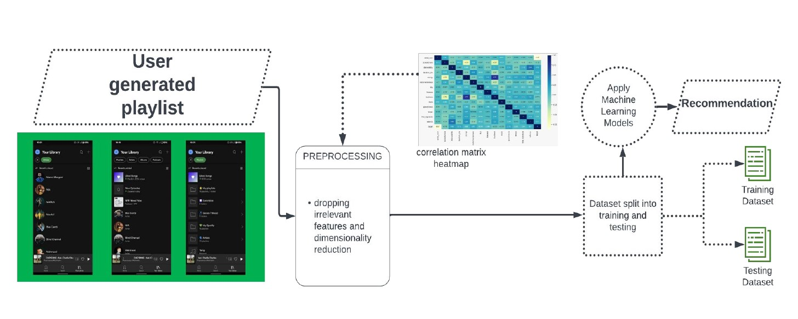
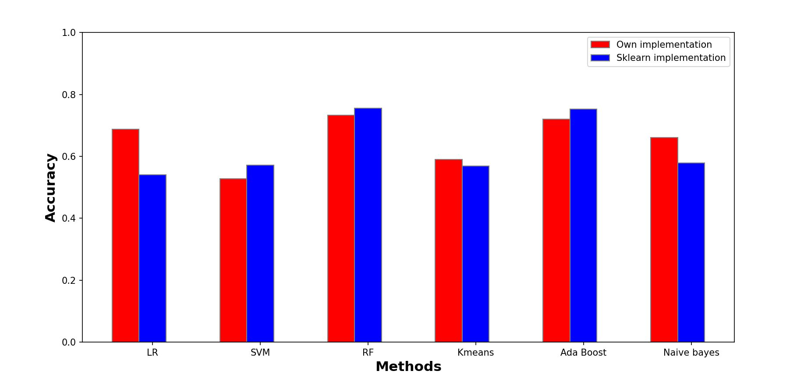

# Spotify song user like/dislike prediction

## About 
The proposal is to implement from scartch a total of 6 different Binary Classification techniques, specifically - Logistic Classifier, Decision Tree, RandomForest, K-Means Clustering, Support Vector Machine, xGBoost.

After preprocessing the data, we plan on passing it through all the ML models in order to train it.

Next, we supply a testinput song and our models determine (with a Boolen output) whether or not the user would like this song or not.

## Dataset used

https://www.kaggle.com/datasets/geomack/spotifyclassification

https://www.kaggle.com/datasets/bricevergnou/spotify-recommendation

## Analysis

